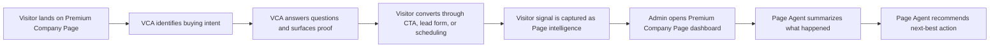

# Premium Company Pages High-Level Flow

High-level flow for the Premium Company Pages full-loop prototype. Shared product context lives in [premium-company-pages.md](./premium-company-pages.md), and the working user story lives in [premium-company-pages-user-story.md](./premium-company-pages-user-story.md).

## Flow Principle

The prototype should show a complete value loop, not a standalone chat moment.

**Visitor intent becomes admin intelligence. Admin intelligence becomes action.**

## Hero Scenario

A high-intent buyer visits a Premium Company Page while evaluating the company. The visitor-facing VCA helps them move forward. The admin-side Page Agent later explains the signal and recommends what the business should do next.

## High-Level Flow

| Step | Surface | What Happens | Why It Matters |
|---|---|---|---|
| 1 | Premium Company Page | Visitor lands on the Page and sees credibility signals: verified-style trust cues, custom CTA, testimonial, highlights, and relevant content. | Establishes that Premium Company Pages improves trust before AI appears. |
| 2 | Visitor-side VCA | VCA appears or is opened with context-aware prompts tied to buyer evaluation. | Makes the Page feel responsive to visitor intent instead of static. |
| 3 | Visitor-side VCA | Visitor asks product-fit or pricing/implementation questions. | Creates a clear buying-intent signal. |
| 4 | Visitor-side VCA | VCA answers, surfaces relevant proof points, and recommends the best next step. | Reduces visitor friction and keeps the Page from becoming a dead end. |
| 5 | Conversion moment | Visitor submits interest, clicks the custom CTA, or schedules time. | Shows measurable business value. |
| 6 | Captured signal | The system records the visitor's intent, question themes, company context, and conversion action as Page intelligence. | Connects visitor behavior to admin-side value. |
| 7 | Admin dashboard | Admin opens the Premium Company Page dashboard and sees a plain-language summary of high-intent activity. | Turns invisible Page activity into an understandable business signal. |
| 8 | Admin-side Page Agent | Page Agent explains what happened, why it matters, and what pattern may be emerging. | Moves beyond reporting into interpretation. |
| 9 | Recommended action | Page Agent recommends concrete next actions: follow up, adjust CTA, draft a post, invite similar visitors, or consider Boost/LMS if the signal warrants it. | Shows how Premium Company Pages creates leverage for the admin. |

## Flow Diagram

## Prototype Beats

### Beat 1: Credible Page

Show the company Page as already more conversion-ready because of Premium Company Page features.

Possible signals:

- gold `in` logo,
- credibility highlights,
- custom testimonial,
- custom CTA,
- dynamic cover image,
- relevant pinned or recent content.

### Beat 2: Visitor Help

Show the VCA helping a buyer-oriented visitor.

The VCA should:

- recognize or clarify buyer intent,
- answer one or two practical questions,
- surface a relevant proof point,
- guide the visitor to a clear conversion path.

### Beat 3: Signal Capture

Make the invisible value visible.

Potential captured signals:

- visitor intent: evaluating product,
- question themes: implementation, pricing, proof, fit,
- account or company context,
- conversion action taken,
- similar visitor patterns.

### Beat 4: Admin Insight

Show the admin dashboard translating activity into plain language.

Example insight:

> Three high-intent visitors from target accounts asked about implementation this week. One scheduled time. This topic is becoming a conversion driver.

### Beat 5: Recommended Action

Show the Page Agent recommending action, not just reporting.

Possible recommendations:

- send a follow-up message,
- publish a post answering the repeated question,
- update the Page CTA,
- add a testimonial related to the visitor concern,
- invite similar engaged members,
- consider Boost or LinkedIn Marketing Solutions if the signal is strong enough.

## Design Scope For First Prototype

Recommended first pass:

1. Public Premium Company Page.
2. Visitor-side VCA conversation.
3. Conversion action.
4. Admin dashboard summary.
5. Page Agent recommended next action.

Defer:

- full onboarding,
- real verification flow,
- real lead routing,
- real scheduling,
- real analytics integration,
- competitor monitoring,
- employee amplification,
- enterprise tier behavior.

## Stakeholder Alignment Notes

The story should help stakeholders align around three ideas:

- **Premium Company Pages is a growth surface**, not only a cosmetic upgrade.
- **VCA and Page Agents are connected**, not two disconnected AI demos.
- **The admin gets leverage**, because the system interprets activity and recommends action instead of simply adding more dashboard data.

## Key Decisions To Make Next

- Choose the example company and visitor scenario.
- Choose the conversion moment: custom CTA, lead form, or scheduling.
- Choose the admin payoff surface: dashboard card, alert, or chat panel.
- Decide whether the final recommendation should include a gentle Boost/LMS upsell.
